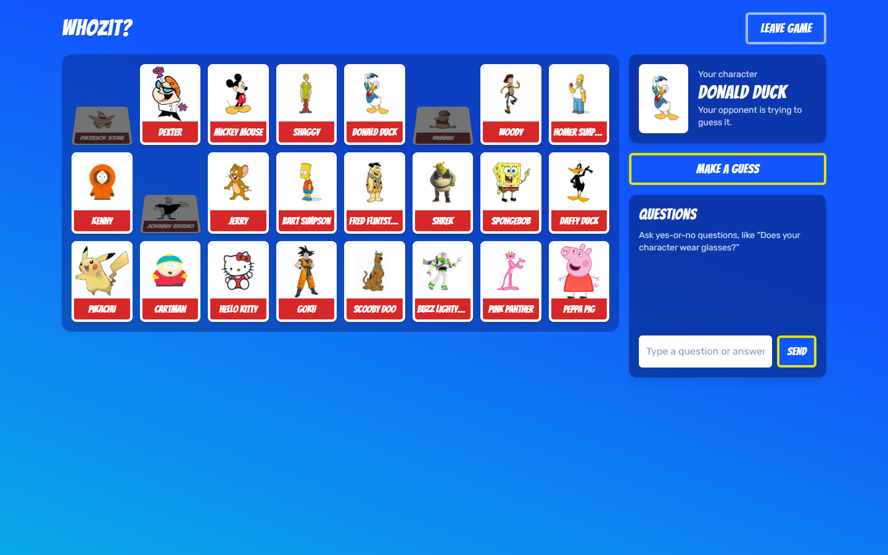

# Whozit?

An online version of the board game _Guess Who?_ for two players. Each player gets a secret character, and you take turns asking yes-or-no questions to find out who your opponent has.

**Play it at [whozit-theta.vercel.app](https://whozit-theta.vercel.app)**



## How to play

1. Open the game and click **Copy invite link**. Send the link to a friend.
2. When your friend joins, you both land in the waiting room. As the host, you pick a character set and start the game.
3. Ask yes-or-no questions in the chat, like "Does your character wear a hat?". Click a card to flip it down when you rule it out.
4. When you think you know who your opponent has, click **Make a guess**, pick the character, and confirm. Guess right and you win; guess wrong and you lose.

The free server goes to sleep when nobody is playing, so the first page load can take up to a minute.

## Add your own character set

Every folder in `backend/media/characters/` is a character set:

1. Create a folder, for example `backend/media/characters/Pokemon/`.
2. Put at least 24 images in it (`.jpg`, `.png` or `.webp`). If there are more than 24, each game picks 24 at random.
3. Name each file after its character. `Homer Simpson.jpg` shows up as "Homer Simpson".

The new set shows up in the waiting room right away. For the online version, commit and push the folder.

## Run it locally

You need Python 3.10 or newer and Node.js 18 or newer.

Start the backend in one terminal:

```sh
git clone https://github.com/RobinLozina/Whozit.git
cd Whozit/backend
python -m venv venv
source venv/bin/activate        # On Windows: venv\Scripts\activate
pip install -r requirements.txt
python manage.py migrate
uvicorn guessWho.asgi:application --host 127.0.0.1 --port 8000
```

Then start the frontend in a second terminal, from the `Whozit` folder:

```sh
cd frontend/guesswho-client
npm install
npm run serve
```

Open [localhost:8080](http://localhost:8080). To play against yourself, paste the invite link into a new tab.

## Deploy your own copy

The backend runs on [Render](https://render.com) and the frontend on [Vercel](https://vercel.com), both on their free plans. Vercel can't host the backend because it doesn't support WebSockets.

1. **Backend:** in Render, choose **New → Blueprint** and select your fork. Render reads [`render.yaml`](render.yaml) and sets everything up, including a random secret key. Copy the URL it gives you, like `https://whozit-api.onrender.com`.
2. **Frontend:** in Vercel, import your fork, set **Root Directory** to `frontend/guesswho-client`, and add the environment variable `VUE_APP_BACKEND_URL` with your Render URL (no trailing `/`).

Both redeploy automatically when you push to `master`. Changing `VUE_APP_BACKEND_URL` doesn't, though: redeploy the frontend by hand after you change it.

The free Render plan has no permanent storage, so the database is reset every time the backend restarts. Games only last one session, so nothing important is lost.

### Environment variables

| Variable               | Where  | What it does                                      | Default                                       |
| ---------------------- | ------ | ------------------------------------------------- | --------------------------------------------- |
| `DJANGO_SECRET_KEY`    | Render | Django's secret key                               | An insecure development key                   |
| `DJANGO_DEBUG`         | Render | `1` turns on debug mode, `0` turns it off         | `1`                                           |
| `DJANGO_ALLOWED_HOSTS` | Render | Comma-separated host names the backend answers to | `*`                                           |
| `VUE_APP_BACKEND_URL`  | Vercel | Address of the backend                            | Port 8000 on the machine that served the page |

`render.yaml` sets the first three for you.

## How it's built

- **Backend:** Django with Django REST Framework for the API and Django Channels for the WebSockets, served by Uvicorn. Game state lives in memory, so the backend runs as a single instance.
- **Frontend:** Vue 3 with Vue Router and Tailwind CSS.
- **Database:** SQLite.

## License

MIT. See [LICENSE.md](LICENSE.md).
